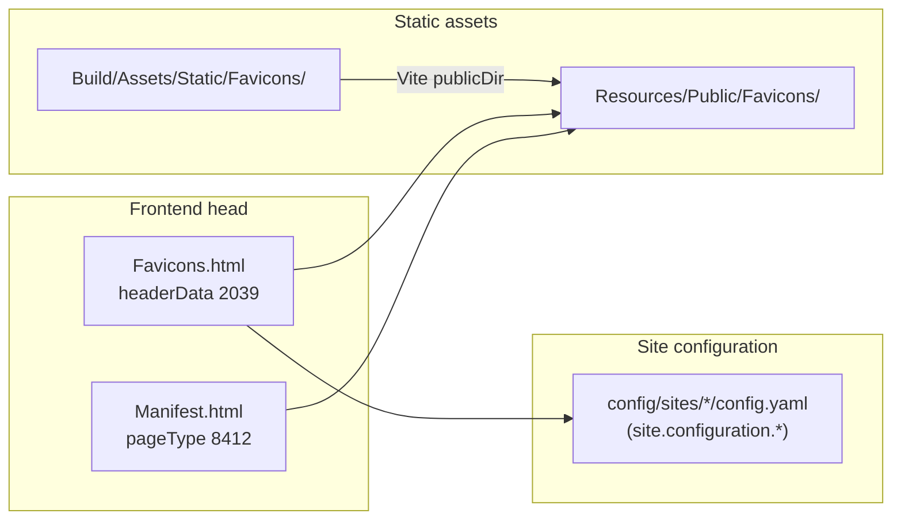

# Favicons & web app manifest

How favicons work in **mpc/mp-core**: asset files, Fluid partial, site configuration, and optional RealFaviconGenerator tooling.

> **Do not** replace `Resources/Private/Partials/Page/Favicons.html` with static HTML from RealFaviconGenerator. The partial is a **Fluid template** that reads **site configuration** (or falls back to bundled files under `Resources/Public/Favicons/`).

---

## Architecture



| Piece | Location | Role |
|-------|----------|------|
| Favicon files | `Build/Assets/Static/Favicons/` → `Resources/Public/Favicons/` | Copied by Vite (`publicDir`); default fallbacks |
| Head partial | `Resources/Private/Partials/Page/Favicons.html` | Emits `<link rel="icon">`, manifest link, optional page meta |
| TypoScript | `Configuration/TypoScript/Setup/Page/Page.Favicon.typoscript` | `page.headerData.2039` = FLUIDTEMPLATE |
| Site Setting override | `pageFaviconsFile` | Alternate partial path (`95.SitePresentationOverrides.typoscript`) |
| Dynamic manifest | `Configuration/TypoScript/Setup/40.Page.Scripts.typoscript` | `typeNum = 8412` → `Manifest.html` (JSON) |
| Site fields (backend) | `Configuration/SiteConfiguration/Overrides/sites.php` | File-link fields on the site record |

---

## Runtime behaviour (`Favicons.html`)

Included via `page.headerData.2039` (see `Page.Favicon.typoscript` and `pageFaviconsFile` in Site Settings).

### Favicon links

If **any** of these site configuration keys is set, the **site-specific** branch is used:

- `favicon-96x96-png`
- `faviconIco`
- `faviconSvg`
- `apple-touch-icon`
- `webmanifest`

| Site field | Output |
|------------|--------|
| `favicon-96x96-png` | `<link rel="icon" sizes="96x96" type="image/png">` |
| `faviconIco` | `<link rel="shortcut icon">` |
| `faviconSvg` | `<link rel="icon" type="image/svg+xml">` |
| `apple-touch-icon` | `<link rel="apple-touch-icon" sizes="180x180">` |
| `webmanifest` | `<link rel="manifest">` → linked FAL file |
| *(no `webmanifest` file)* | `<link rel="manifest" href="{f:uri.page(pageType: 8412)}">` → dynamic JSON |

If **none** of those keys are set, **defaults** from the extension are used:

| File | Path |
|------|------|
| PNG 96×96 | `EXT:mp_core/Resources/Public/Favicons/favicon-96x96.png` |
| ICO | `EXT:mp_core/Resources/Public/Favicons/favicon.ico` |
| SVG | `EXT:mp_core/Resources/Public/Favicons/favicon.svg` |
| Apple touch | `EXT:mp_core/Resources/Public/Favicons/apple-touch-icon.png` |
| Manifest | `f:uri.page(pageType: 8412)` (dynamic) |

All `href` values go through `f:uri.image` (site files) or `f:uri.page` (manifest).

### Extra `<meta>` tags (same partial)

When page data is available:

| Condition | Meta tag |
|-----------|----------|
| `{data.keywords}` | `keywords` |
| `{data.lastUpdated}` | `last-modified` |
| `{data.author}` | `author` |
| `{data.author_email}` | `email` |

---

## Site record (backend)

**Site Management → Sites → [site] → Configuration** — tab **Favicons** (`sites.php`):

| Field | Purpose |
|-------|---------|
| `favicon-96x96-png` | Primary PNG favicon |
| `faviconIco` | `favicon.ico` |
| `faviconSvg` | SVG favicon |
| `apple-touch-icon` | iOS home screen |
| `webmanifest` | Static `site.webmanifest` file (optional; else dynamic manifest) |
| `web-app-manifest-192x192` | PWA icon 192×192 (for static manifest packages) |
| `web-app-manifest-512x512` | PWA icon 512×512 |

Set file links in the UI or in `config/sites/[site]/config.yaml`, for example:

```yaml
faviconSvg: 't3://file?uid=123'
favicon-96x96-png: 't3://file?uid=124'
```

Labels and hints: `Resources/Private/Language/locallang_db.xlf` (`site.configuration.*`).

---

## Dynamic web manifest (`pageType` 8412)

Defined in `Configuration/TypoScript/Setup/40.Page.Scripts.typoscript`:

- URL: same page with `typeNum=8412` (via `f:uri.page(pageType: 8412)` in `Favicons.html`)
- Template: `Resources/Private/Partials/Page/Manifest.html`
- `Content-Type: application/manifest+json`, cacheable 24h

`Manifest.html` builds JSON with:

- `name` / `short_name` from `site.configuration.pwaName` / `pwaShortName`, else site title / identifier
- Icons: `web-app-manifest-192x192.png` and `web-app-manifest-512x512.png` under `Resources/Public/Favicons/`
- Default `theme_color` / `background_color`: `#333333`

Optional PWA keys (`pwaName`, `pwaShortName`) can be added in `config.yaml` even though they are not registered in `sites.php` TCA yet.

---

## Generating / updating icon files

Use [RealFaviconGenerator](https://realfavicongenerator.net/) when you need a full icon set (ICO, PNG sizes, Apple touch, manifest icons).

### Option A — Website (quick)

1. Upload master image (512×512 PNG or SVG recommended).
2. Download the ZIP.
3. Extract into **`Build/Assets/Static/Favicons/`** (not into `Resources/Public/` directly).
4. From `Build/`: `npm run build` or `npm run watch` (copies static assets to `Resources/Public/Favicons/`).

### Option B — CLI (CI-friendly)

Example using the checked-in `Build/favicon-settings.json` (adjust `path`, names, and colours for your project):

```bash
cd Build
npx realfavicon generate ./Assets/Images/favicon.png favicon-settings.json favicon-output.json ./Assets/Static/Favicons
npx realfavicon inject favicon-output.json ./Assets/Static/Favicons ./Assets/Static/Favicons/output.html
npm run build
```

Generated artefacts:

| File | Use |
|------|-----|
| `favicon-output.json` | Generator metadata (optional in VCS) |
| `output.html` | **Reference only** — sample static `<head>` tags; do **not** paste into `Favicons.html` |
| Icon files + `site.webmanifest` | Shipped via Vite to `Resources/Public/Favicons/` |

Update `path` in `favicon-settings.json` to match your deployed asset path if you serve icons from a fixed URL prefix.

### Expected filenames (defaults)

After a full generation, these should exist under `Resources/Public/Favicons/`:

- `favicon.svg`, `favicon.ico`, `favicon-96x96.png`
- `apple-touch-icon.png`
- `web-app-manifest-192x192.png`, `web-app-manifest-512x512.png`
- `site.webmanifest` (optional if you use dynamic manifest only)

---

## Site Settings

| Key | Default |
|-----|---------|
| `pageFaviconsFile` | `EXT:mp_core/Resources/Private/Partials/Page/Favicons.html` |

Override in Site Settings or `settings.yaml` only if you provide a custom Fluid partial.

---

## Validation

- [RealFaviconGenerator favicon checker](https://realfavicongenerator.net/favicon_checker)
- In the browser: inspect `<head>` links and request `?type=8412` for manifest JSON
- CLI update check (if you keep `favicon-output.json`): `npx real-favicon check-for-update favicon-output.json`

---

## Related documentation

- [Configuration](Configuration.md) — site `config.yaml` fields
- [Frontend](Frontend.md) — Vite `publicDir` and static assets
- [Backend](Backend.md) — site configuration UI
